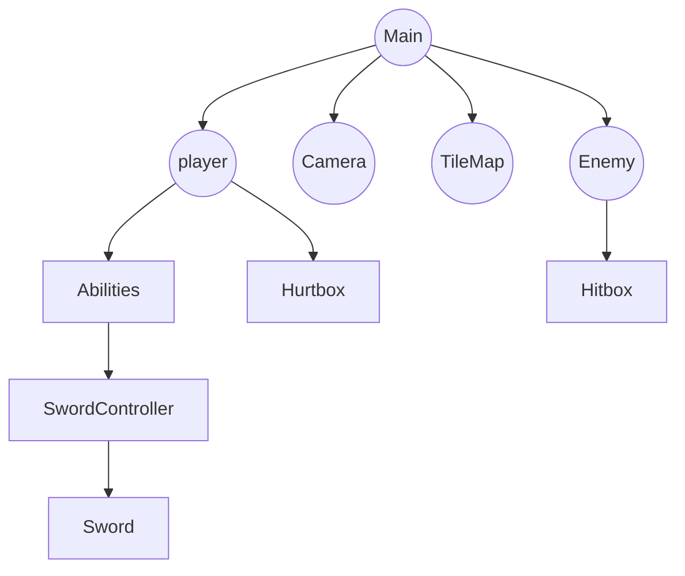

```mermaid
graph TD;
id1((Main)) -->id2((Player));
id2((player)) --> Abilities
Abilities --> SwordController
SwordController --> Sword
id4 --> Hitbox
id2 --> Hurtbox
id1((Main)) -->id3((Camera));
id1((Main)) -->id5((TileMap));
id1((Main)) -->id4((Enemy));
```